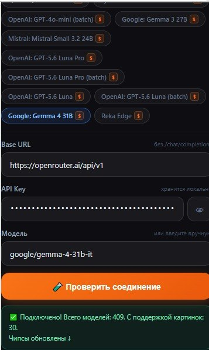
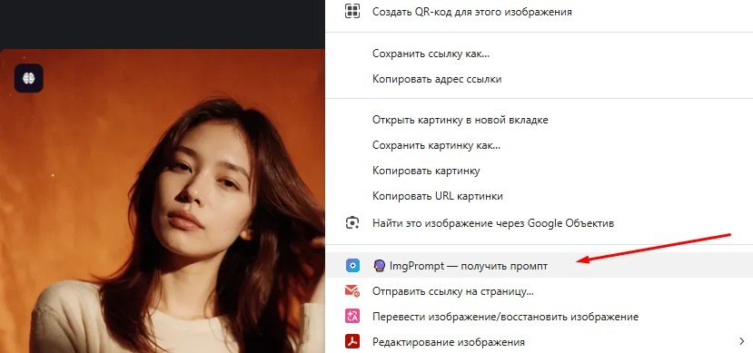
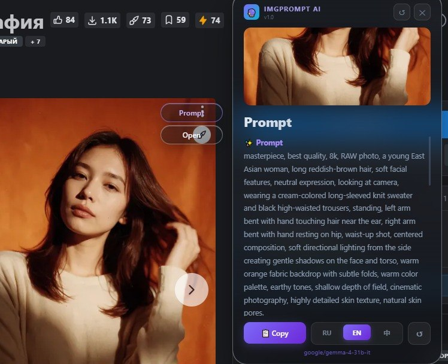
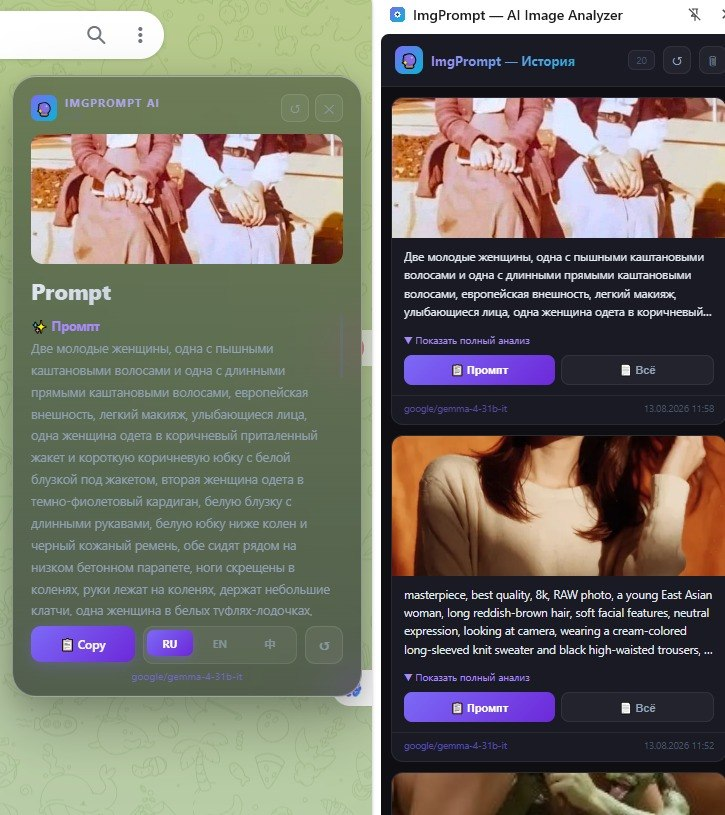

# 🔮 ImgPrompt AI

**Chrome расширение для генерации промптов по картинке с помощью AI**

[](https://opensource.org/licenses/MIT)
[](https://developer.chrome.com/docs/extensions/)

---

## ✨ Что умеет

- 📸 **Анализирует любую картинку** на странице одним кликом
- ✨ **Генерирует промпт** + негатив + подробный разбор сцены
- 🌊 **Форматы:** Stable Diffusion / FLUX / Midjourney / NovelAI
- 🤖 **Vision-модели без цензуры:** Qwen2.5 VL 72B, NVIDIA Nemotron, Llama 4 и др.
- 🕒 **История промптов** в боковой панели с возможностью удаления
- 🌐 **OpenRouter** (300+ моделей) и **Groq** из коробки
- 🦙 **Локальные модели:** Ollama, LM Studio, Jan — без API ключа
- 📐 **Авто-сжатие** изображений + настройка качества JPEG
- ⏱️ **Таймаут и отмена** запроса прямо из боковой панели
- 🇷🇺 🇨🇳 🇬🇧 Три языка интерфейса

---

## 📸 Скриншоты

| Popup с локальными провайдерами | Выбор модели |
|:---:|:---:|
|  |  |

| Контекстное меню | Результат анализа |
|:---:|:---:|
|  |  |

| Панель истории |
|:---:|
|  |

## 🚀 Установка

> Chrome Web Store пока не поддерживается — устанавливается вручную за 30 секунд.

1. Скачай ZIP → **[Releases](../../releases/latest)**
2. Распакуй в любую папку
3. Открой Chrome → `chrome://extensions/`
4. Включи **Режим разработчика** (правый верхний угол)
5. Нажми **Загрузить распакованное расширение** → выбери папку
6. Готово! Иконка появится в панели браузера

---

## 🌐 Совместимые браузеры

| Браузер | Поддержка |
|---|---|
| Google Chrome | ✅ Полная |
| Microsoft Edge | ✅ Полная |
| Brave | ✅ Полная |
| Opera / Opera GX | ✅ Полная |
| Vivaldi | ✅ Полная |
| Cent Browser | ✅ Полная |
| Firefox | ❌ Не поддерживается |

> Firefox использует другой API для боковых панелей — портирование потребует отдельной версии.

---


1. Нажми на иконку расширения
2. Получи бесплатный ключ на [openrouter.ai](https://openrouter.ai) (есть полностью бесплатные модели)
3. Вставь ключ в поле **API Key** → **Сохранить**
4. Выбери модель из списка

---

## 🎯 Как пользоваться

1. Наведи мышь на любую картинку в браузере
2. Нажми кнопку **🔮 Prompt** которая появится поверх картинки
3. Готово — промпт появится во всплывающем окне и сохранится в истории
4. Нажми **📋 Промпт** чтобы скопировать или **📄 Всё** для полного анализа

---

## 🤖 Рекомендуемые модели

| Модель | Цензура | Цена | Статус |
|---|---|---|---|
| `google/gemma-4-31b-it` | 🟡 Средняя | FREE | ⭐ **По умолчанию** |
| `qwen/qwen2.5-vl-72b-instruct:free` | 🟡 Средняя | FREE | ✅ Стабильная |
| `meta-llama/llama-4-scout` | 🟢 Низкая | $ | ✅ Стабильная |
| `qwen/qwen3-vl-32b-instruct` | 🟡 Средняя | $ | ✅ Стабильная |
| `nvidia/llama-3.1-nemotron-nano-vl-8b-v1:free` | 🟢 Низкая | FREE | ⚠️ Нестабильная |

> Модель по умолчанию можно сменить в любой момент — просто нажми на чип или введи ID вручную.

---

## 📦 Структура проекта

```
imgprompt-ai/
├── manifest.json       # Конфигурация расширения
├── popup.html/js       # Главный интерфейс
├── sidepanel.html/js   # Боковая панель с историей
├── background.js       # Service worker (API запросы)
├── content.js          # Инъекция в страницы
├── prompts.js          # Системные промпты (RU/EN/ZH)
└── icons/              # Иконки расширения
```

---

## 🔐 Безопасность API ключа

**Вопрос:** куда сохраняется API ключ? Не утечёт ли он?

**Ответ:** ключ хранится **только локально** в зашифрованном хранилище браузера (`chrome.storage.sync`). Расширение не имеет своего сервера — запросы идут **напрямую** с твоего компьютера на OpenRouter/Groq. Никто кроме тебя ключ не видит.

---

## ☕ Поддержать автора

Если расширение оказалось полезным:

**[☕ Отправить на кофе через ЮMoney](https://yoomoney.ru/to/410013803949909)**

---

## 📄 Лицензия

MIT — используй, модифицируй, распространяй свободно.
